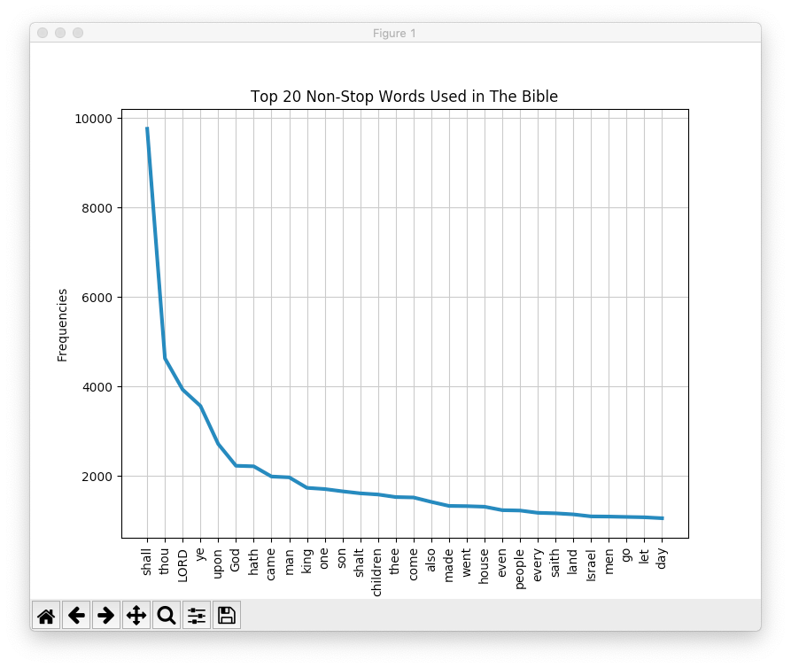
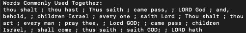

# NaturalLanguageProcessing
A Set of Programs to Show Details About Text

## Functionality
 * Plot most commonly used words in text
    * Specify number of points
    * Specify title
    * Specify y-axis
    * Specify line-width (default 3)
 * Get top collocations ([more on collocations](https://nlp.stanford.edu/fsnlp/promo/colloc.pdf))
    * Specify amount
    * Specify window size
 * Ability to exclude "stop words" (words such as as, is, I, the, etc...)
    * Ability to specify extra words to be excluded from list (blacklist)

## Requirements
* Python 3
* NLTK

## Showcase
### Top 20 Non-Stop Words And Collocations For The Bible
| Top 20 Used Words | Top Collocations |
| ------------- | ------------- | 
|  |  | 

### To Run
```
python3 plotTextDetails.py /books/TheBible.txt --title "Top 20 Non-Stop Words Used in The Bible" 
        --numCollocations 20 --windowSize 4 --blacklist "said, unto, thy, and"
```

## How To Run
From Terminal, the following is what must be provided for the program to run.
```
python3 plotTextDetails.py <Address to Book>
```
### List of Customization Flags
### For Frequency Graph And Collocations
 * ```--blacklist``` - Blacklist of words (seperated by comas) that will be excluded from collocations and frequency graph
#### For Frequency Graph Only
 * ```--numPoints``` - Number of points on graph (default = 30)
 * ```--title``` - Customizes the title of the frequency graph (default = "Top X Useful Words For Y", X = number of points, Y = Path to Book)
 * ```--ylabel``` - Customizes the y-axis title (default = "Frequencies")
 * ```--linewidth``` - Customizes the width of the line (default = 3)
### For Collocations Only
 * ```--numCollocations``` - Number of collocations (default is 20)
 * ```--windowSize``` - Window Size of Collocations ([can read about window size here](https://nlp.stanford.edu/fsnlp/promo/colloc.pdf), default = 4)
